# ERD SINAU

Dihasilkan otomatis dari database (`npm run db:snapshot`). 122 tabel, prefix `tbl_sinau_`, PK `char(36)` UUID. Tabel milik lembaga memiliki kolom `tenant_id` → `tenants.id`.

Setiap bagian adalah diagram Mermaid `erDiagram` per domain; relasi antar domain digambarkan melalui kolom FK di daftar kolom.

## Platform & akun

```mermaid
erDiagram
  audit_logs {
    char_36 id PK
    char_36 tenant_id
    char_36 user_id
    varchar_80 action
    varchar_60 entity
    varchar_36 entity_id
    longtext before_data
    longtext after_data
    varchar_64 ip
    varchar_255 user_agent
    timestamp created_at
    timestamp updated_at
  }
  feature_flags {
    char_36 id PK
    char_36 tenant_id
    varchar_80 flag_key
    tinyint_1 enabled
    longtext config
    timestamp created_at
    timestamp updated_at
  }
  files {
    char_36 id PK
    char_36 tenant_id
    char_36 uploaded_by
    varchar_40 module
    varchar_255 original_name
    varchar_400 stored_path
    varchar_120 mime
    int_11 size
    tinyint_1 is_public
    timestamp created_at
    timestamp updated_at
  }
  guardians {
    char_36 id PK
    char_36 tenant_id
    char_36 user_id
    varchar_20 relation
    varchar_100 occupation
    text address
    timestamp created_at
    timestamp updated_at
  }
  guardian_students {
    char_36 id PK
    char_36 tenant_id
    char_36 guardian_user_id
    char_36 student_id
    varchar_20 relation
    tinyint_1 is_primary
    timestamp created_at
    timestamp updated_at
  }
  import_batches {
    char_36 id PK
    char_36 tenant_id
    varchar_40 type
    varchar_255 file_name
    int_11 total
    int_11 success
    int_11 failed
    varchar_20 status
    char_36 created_by
    timestamp created_at
    timestamp updated_at
  }
  import_errors {
    char_36 id PK
    char_36 batch_id FK
    int_11 row_no
    varchar_500 message
    longtext raw
  }
  invitations {
    char_36 id PK
    char_36 tenant_id
    varchar_190 email
    varchar_150 full_name
    varchar_40 role
    char_64 token_hash
    datetime expires_at
    datetime accepted_at
    char_36 created_by
    timestamp created_at
    timestamp updated_at
  }
  jobs {
    char_36 id PK
    char_36 tenant_id
    varchar_60 type
    longtext payload
    varchar_20 status
    int_11 attempts
    int_11 max_attempts
    datetime run_at
    datetime locked_at
    datetime finished_at
    longtext result
    text error
    char_36 created_by
    timestamp created_at
    timestamp updated_at
  }
  kota {
    int_10_unsigned id PK
    int_10_unsigned provinsi_id FK
    varchar_6 kode
    varchar_100 nama
  }
  migrations {
    varchar_120 name PK
    timestamp applied_at
  }
  notifications {
    char_36 id PK
    char_36 tenant_id
    char_36 user_id FK
    varchar_40 type
    varchar_200 title
    text body
    varchar_255 link
    datetime read_at
    timestamp created_at
    timestamp updated_at
  }
  password_resets {
    char_36 id PK
    char_36 user_id FK
    char_64 token_hash
    datetime expires_at
    datetime used_at
    timestamp created_at
  }
  permissions {
    varchar_80 code PK
    varchar_40 module
    varchar_200 description
  }
  provinsi {
    int_10_unsigned id PK
    varchar_4 kode
    varchar_100 nama
  }
  refresh_tokens {
    char_36 id PK
    char_36 user_id FK
    char_64 token_hash
    datetime expires_at
    datetime revoked_at
    char_36 replaced_by
    varchar_255 user_agent
    varchar_64 ip
    timestamp created_at
  }
  role_permissions {
    char_36 id PK
    char_36 tenant_id
    varchar_40 role
    varchar_80 permission_code
    timestamp created_at
    timestamp updated_at
  }
  staff_profiles {
    char_36 user_id PK
    char_36 tenant_id
    varchar_30 nip
    varchar_30 nuptk
    varchar_20 nik
    char_36 position_id
    varchar_20 employment_status
    date join_date
    date birth_date
    varchar_100 birth_place
    text address
    varchar_80 education
    varchar_30 npwp
    varchar_60 bank_name
    varchar_40 bank_account
    varchar_10 ptkp_status
    text notes
    timestamp created_at
    timestamp updated_at
  }
  student_profiles {
    char_36 user_id PK
    char_36 tenant_id
    varchar_30 nis
    varchar_20 nisn
    varchar_20 nik
    varchar_100 birth_place
    date birth_date
    varchar_30 religion
    text address
    int_10_unsigned provinsi_id
    int_10_unsigned kota_id
    smallint_6 entry_year
    char_36 major_id
    varchar_20 status
    varchar_150 parent_name
    varchar_30 parent_phone
    varchar_3 blood_type
    text notes
    timestamp created_at
    timestamp updated_at
  }
  tenants {
    char_36 id PK
    varchar_60 slug
    varchar_200 name
    varchar_20 type
    varchar_20 category
    varchar_20 npsn
    int_10_unsigned provinsi_id
    int_10_unsigned kota_id
    text address
    varchar_30 phone
    varchar_190 email
    varchar_190 website
    varchar_150 principal_name
    tinyint_1 is_active
    timestamp created_at
    timestamp updated_at
    timestamp deleted_at
  }
  tenant_branding {
    char_36 tenant_id PK
    varchar_120 display_name
    varchar_200 tagline
    varchar_255 logo_url
    varchar_255 favicon_url
    varchar_9 primary_color
    varchar_9 accent_color
    varchar_10 theme
    timestamp created_at
    timestamp updated_at
  }
  tenant_settings {
    char_36 tenant_id PK
    tinyint_1 self_registration
    varchar_10 portal_share
    varchar_20 approval_flow
    varchar_40 timezone
    tinyint_1 maintenance
    varchar_255 maintenance_message
    tinyint_1 data_saver_default
    longtext grade_scale
    longtext extra
    timestamp created_at
    timestamp updated_at
  }
  users {
    char_36 id PK
    char_36 tenant_id FK
    varchar_60 username
    varchar_190 email
    varchar_100 password_hash
    varchar_150 full_name
    varchar_30 phone
    varchar_255 avatar_url
    char_1 gender
    tinyint_1 is_active
    tinyint_1 must_change_password
    int_11 token_version
    timestamp last_login_at
    tinyint_1 data_saver
    varchar_10 theme
    timestamp created_at
    timestamp updated_at
    timestamp deleted_at
  }
  user_onboarding {
    char_36 user_id PK
    longtext steps
    datetime completed_at
    timestamp created_at
    timestamp updated_at
  }
  user_permission_overrides {
    char_36 id PK
    char_36 tenant_id
    char_36 user_id
    varchar_80 permission_code
    varchar_5 effect
    timestamp created_at
    timestamp updated_at
  }
  user_roles {
    char_36 id PK
    char_36 tenant_id
    char_36 user_id FK
    varchar_40 role
    timestamp created_at
    timestamp updated_at
  }
  users ||--o{ guardians : "user_id"
  import_batches ||--o{ import_errors : "batch_id"
  provinsi ||--o{ kota : "provinsi_id"
  users ||--o{ notifications : "user_id"
  users ||--o{ password_resets : "user_id"
  users ||--o{ refresh_tokens : "user_id"
  users ||--o{ staff_profiles : "user_id"
  users ||--o{ student_profiles : "user_id"
  tenants ||--o{ tenant_branding : "tenant_id"
  tenants ||--o{ tenant_settings : "tenant_id"
  tenants ||--o{ users : "tenant_id"
  users ||--o{ user_onboarding : "user_id"
  users ||--o{ user_roles : "user_id"
```

## Akademik

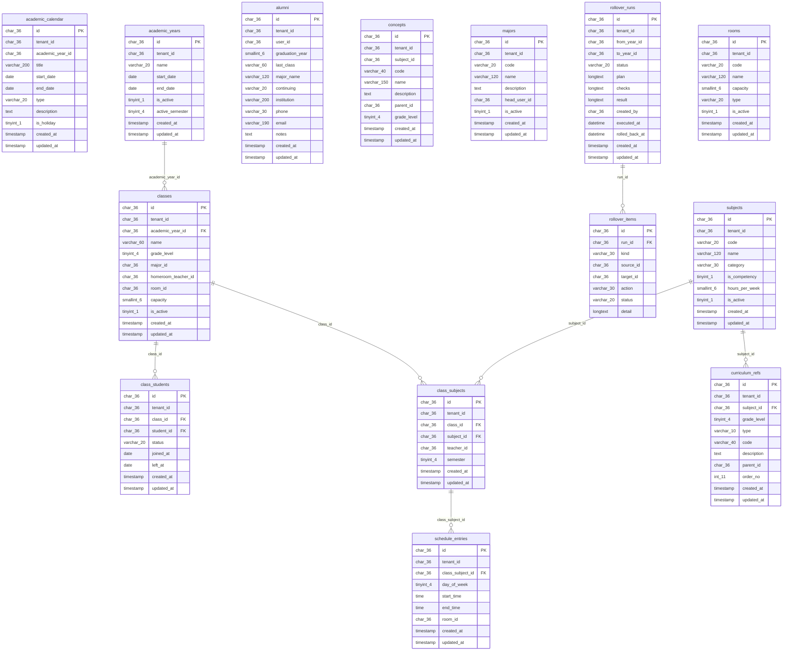

## LMS

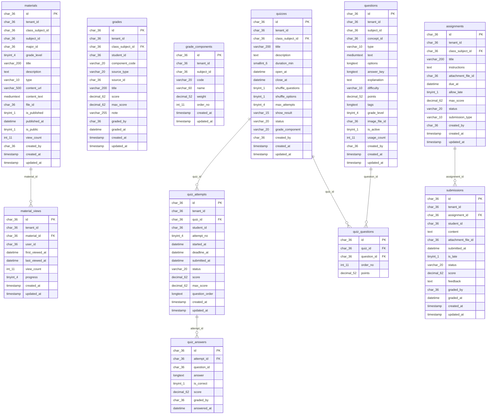

## Presensi

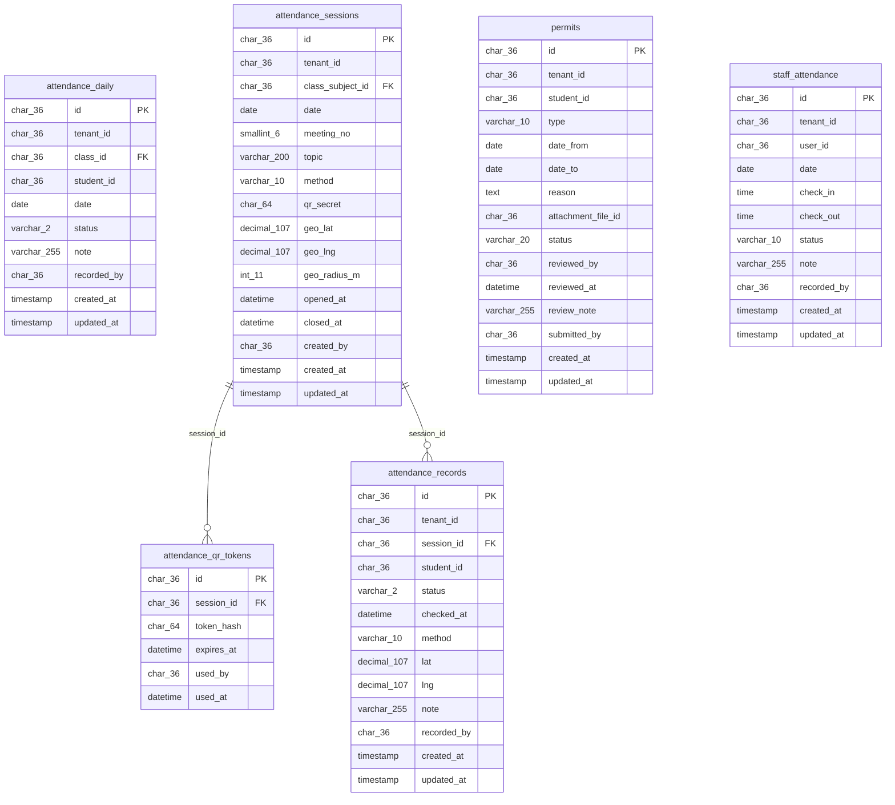

## Ujian & Rapor

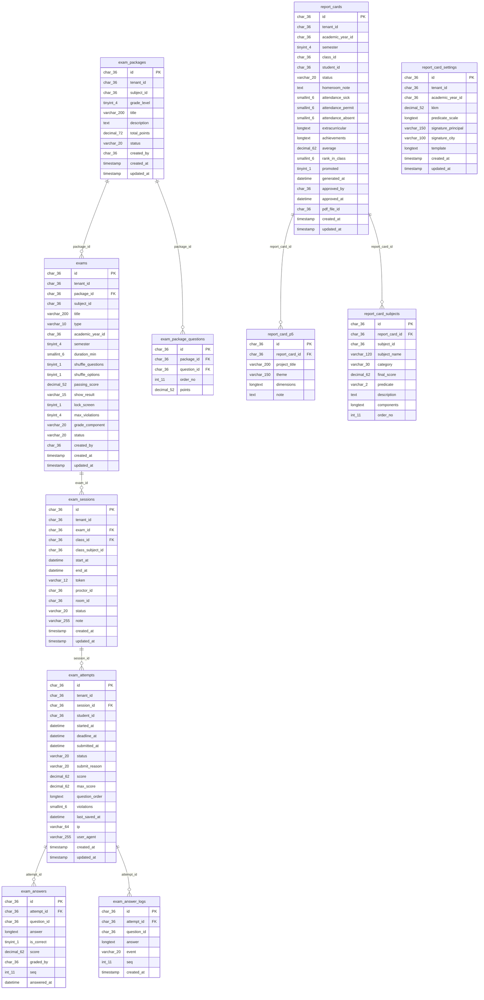

## Kesiswaan

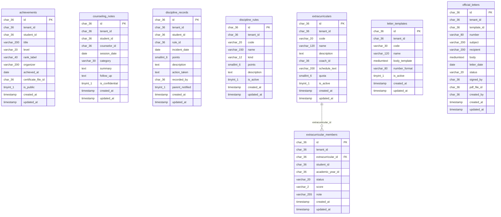

## Keuangan & Payroll

```mermaid
erDiagram
  cash_flows {
    char_36 id PK
    char_36 tenant_id
    date tx_date
    varchar_3 direction
    varchar_60 category
    decimal_152 amount
    varchar_255 description
    varchar_30 reference_type
    char_36 reference_id
    char_36 created_by
    timestamp created_at
    timestamp updated_at
  }
  fee_types {
    char_36 id PK
    char_36 tenant_id
    varchar_20 code
    varchar_120 name
    decimal_152 default_amount
    varchar_10 period
    tinyint_1 is_active
    timestamp created_at
    timestamp updated_at
  }
  invoices {
    char_36 id PK
    char_36 tenant_id
    varchar_40 number
    char_36 student_id
    char_36 academic_year_id
    char_36 fee_type_id
    varchar_200 title
    varchar_7 period
    decimal_152 amount
    decimal_152 discount
    decimal_152 late_fee
    decimal_152 paid
    date due_date
    varchar_20 status
    varchar_255 note
    char_36 created_by
    timestamp created_at
    timestamp updated_at
  }
  job_positions {
    char_36 id PK
    char_36 tenant_id
    varchar_20 code
    varchar_120 name
    decimal_152 base_salary
    tinyint_1 is_active
    timestamp created_at
    timestamp updated_at
  }
  late_fee_rules {
    char_36 id PK
    char_36 tenant_id
    char_36 fee_type_id
    smallint_6 grace_days
    varchar_10 mode
    decimal_152 amount
    decimal_152 max_amount
    tinyint_1 is_active
    timestamp created_at
    timestamp updated_at
  }
  payments {
    char_36 id PK
    char_36 tenant_id
    varchar_40 number
    char_36 student_id
    decimal_152 amount
    varchar_20 method
    varchar_100 reference
    datetime paid_at
    char_36 received_by
    varchar_255 note
    varchar_20 status
    char_36 proof_file_id
    timestamp created_at
    timestamp updated_at
  }
  payment_allocations {
    char_36 id PK
    char_36 payment_id FK
    char_36 invoice_id FK
    decimal_152 amount
  }
  payroll_components {
    char_36 id PK
    char_36 tenant_id
    varchar_20 code
    varchar_120 name
    varchar_10 kind
    varchar_10 calc
    decimal_152 default_amount
    tinyint_1 taxable
    int_11 order_no
    tinyint_1 is_active
    timestamp created_at
    timestamp updated_at
  }
  payroll_period_configs {
    char_36 id PK
    char_36 tenant_id
    tinyint_4 pay_day
    decimal_52 bpjs_kes_employee
    decimal_52 bpjs_kes_employer
    decimal_52 bpjs_tk_jht_employee
    decimal_52 bpjs_tk_jht_employer
    decimal_52 bpjs_tk_jp_employee
    decimal_52 bpjs_tk_jp_employer
    decimal_52 bpjs_tk_jkk
    decimal_52 bpjs_tk_jkm
    decimal_152 bpjs_kes_cap
    tinyint_1 apply_pph21
    timestamp created_at
    timestamp updated_at
  }
  payroll_runs {
    char_36 id PK
    char_36 tenant_id
    varchar_7 period
    varchar_20 status
    decimal_152 total_gross
    decimal_152 total_net
    int_11 employee_count
    char_36 validated_by
    char_36 finance_approved_by
    char_36 principal_approved_by
    datetime paid_at
    varchar_255 note
    char_36 created_by
    timestamp created_at
    timestamp updated_at
  }
  payroll_run_items {
    char_36 id PK
    char_36 run_id FK
    char_36 user_id
    decimal_152 gross
    decimal_152 deductions
    decimal_152 bpjs_employee
    decimal_152 bpjs_employer
    decimal_152 pph21
    decimal_152 net
    longtext detail_lines
    smallint_6 attendance_days
  }
  payslips {
    char_36 id PK
    char_36 tenant_id
    char_36 run_item_id
    char_36 user_id
    varchar_7 period
    char_36 pdf_file_id
    datetime issued_at
    datetime viewed_at
    timestamp created_at
    timestamp updated_at
  }
  reconciliation_batches {
    char_36 id PK
    char_36 tenant_id
    varchar_255 file_name
    varchar_60 bank_name
    int_11 total_rows
    int_11 matched
    int_11 unmatched
    varchar_20 status
    char_36 created_by
    timestamp created_at
    timestamp updated_at
  }
  reconciliation_items {
    char_36 id PK
    char_36 batch_id FK
    date tx_date
    varchar_255 description
    decimal_152 amount
    varchar_100 reference
    char_36 payment_id
    varchar_20 status
  }
  refunds {
    char_36 id PK
    char_36 tenant_id
    char_36 payment_id
    char_36 student_id
    decimal_152 amount
    text reason
    varchar_20 status
    char_36 approved_by
    datetime approved_at
    datetime paid_at
    char_36 created_by
    timestamp created_at
    timestamp updated_at
  }
  salary_structures {
    char_36 id PK
    char_36 tenant_id
    char_36 user_id
    char_36 component_id FK
    decimal_152 amount
    date effective_from
    timestamp created_at
    timestamp updated_at
  }
  invoices ||--o{ payment_allocations : "invoice_id"
  payments ||--o{ payment_allocations : "payment_id"
  payroll_runs ||--o{ payroll_run_items : "run_id"
  reconciliation_batches ||--o{ reconciliation_items : "batch_id"
  payroll_components ||--o{ salary_structures : "component_id"
```

## Sarana & Perpustakaan

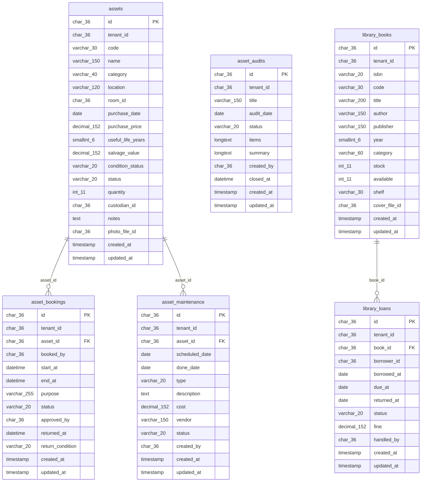

## PPDB

```mermaid
erDiagram
  ppdb_applicants {
    char_36 id PK
    char_36 tenant_id
    char_36 period_id FK
    varchar_30 registration_no
    char_36 user_id
    varchar_150 full_name
    varchar_20 nisn
    varchar_20 nik
    char_1 gender
    varchar_100 birth_place
    date birth_date
    varchar_200 origin_school
    text address
    varchar_30 phone
    varchar_190 email
    varchar_150 parent_name
    varchar_30 parent_phone
    char_36 major_choice_1
    char_36 major_choice_2
    varchar_30 path
    char_64 access_token
    varchar_20 status
    decimal_62 score
    char_36 verified_by
    datetime verified_at
    varchar_255 verification_note
    char_36 accepted_major_id
    char_36 enrolled_user_id
    char_36 enrolled_class_id
    timestamp created_at
    timestamp updated_at
  }
  ppdb_documents {
    char_36 id PK
    char_36 applicant_id FK
    varchar_40 doc_type
    char_36 file_id
    varchar_20 status
    varchar_255 note
    timestamp created_at
  }
  ppdb_periods {
    char_36 id PK
    char_36 tenant_id
    varchar_120 name
    char_36 academic_year_id
    datetime open_at
    datetime close_at
    int_11 quota
    longtext requirements
    longtext paths
    tinyint_1 is_active
    text announcement
    timestamp created_at
    timestamp updated_at
  }
  ppdb_periods ||--o{ ppdb_applicants : "period_id"
  ppdb_applicants ||--o{ ppdb_documents : "applicant_id"
```

## SMK

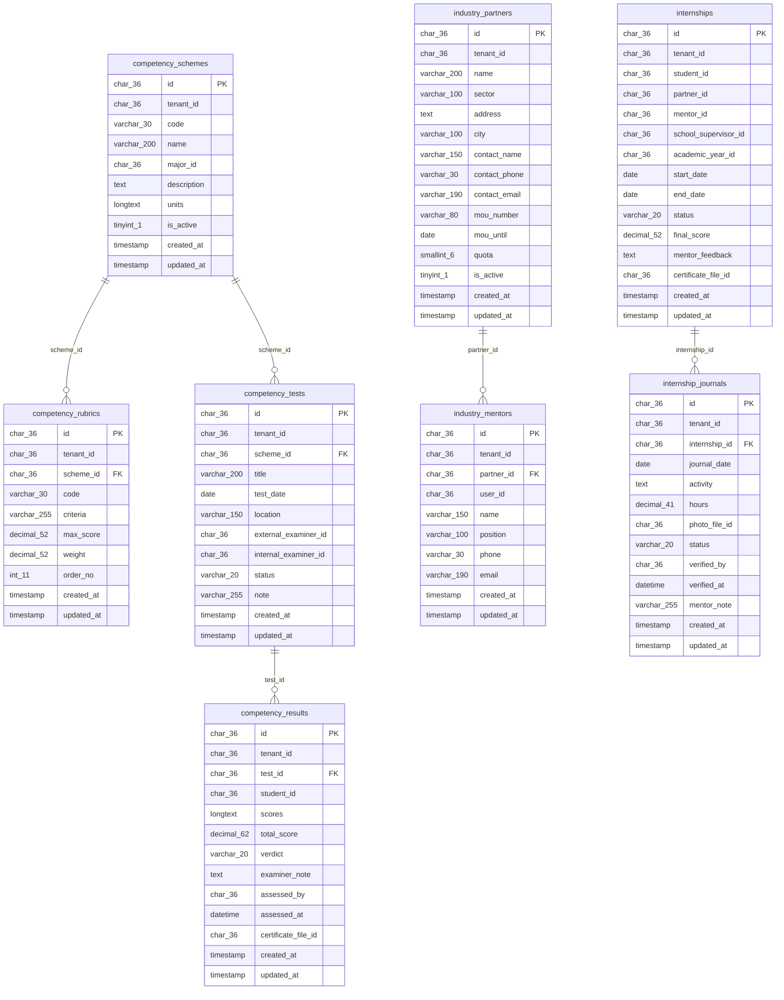

## Kepatuhan (PDP/Dapodik)

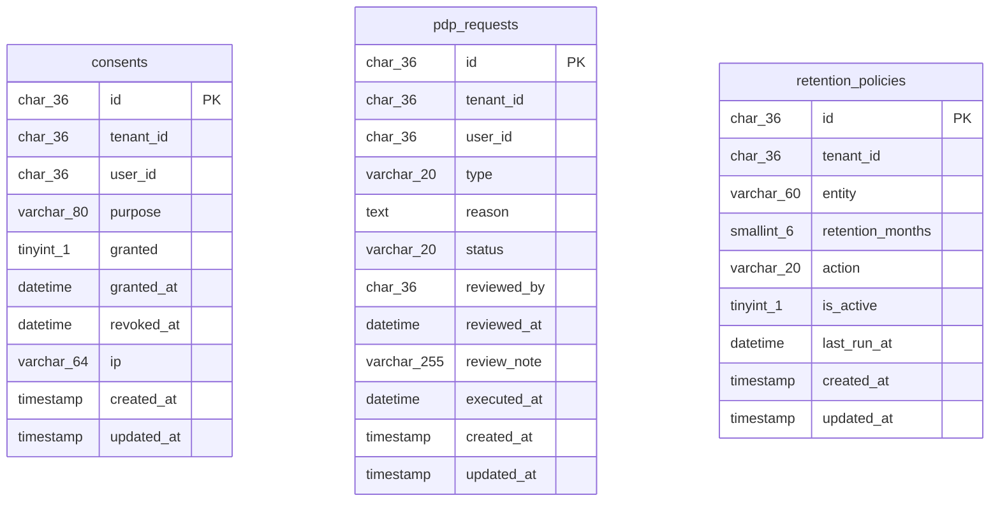

## Komunikasi & Landing

```mermaid
erDiagram
  announcements {
    char_36 id PK
    char_36 tenant_id
    varchar_200 title
    text body
    varchar_10 audience
    varchar_40 audience_role
    char_36 class_id
    tinyint_1 is_pinned
    datetime publish_at
    datetime expires_at
    char_36 attachment_file_id
    char_36 created_by
    timestamp created_at
    timestamp updated_at
  }
  contact_messages {
    char_36 id PK
    char_36 tenant_id
    varchar_150 name
    varchar_190 email
    varchar_30 phone
    varchar_200 subject
    text message
    varchar_20 status
    varchar_64 ip
    timestamp created_at
    timestamp updated_at
  }
  dashboard_configs {
    char_36 id PK
    char_36 tenant_id
    varchar_40 role
    longtext widgets
    timestamp created_at
    timestamp updated_at
  }
  facilities {
    char_36 id PK
    char_36 tenant_id
    varchar_150 name
    text description
    char_36 photo_file_id
    tinyint_1 is_published
    int_11 order_no
    timestamp created_at
    timestamp updated_at
  }
  faqs {
    char_36 id PK
    char_36 tenant_id
    varchar_300 question
    text answer
    varchar_60 category
    tinyint_1 is_published
    int_11 order_no
    timestamp created_at
    timestamp updated_at
  }
  gallery_items {
    char_36 id PK
    char_36 tenant_id
    varchar_150 title
    char_36 file_id
    varchar_100 album
    tinyint_1 is_published
    int_11 order_no
    timestamp created_at
    timestamp updated_at
  }
  landing_pages {
    char_36 id PK
    char_36 tenant_id
    varchar_40 slug
    varchar_150 title
    varchar_200 hero_title
    varchar_300 hero_subtitle
    char_36 hero_image_file_id
    longtext sections
    varchar_300 seo_description
    tinyint_1 is_published
    int_11 order_no
    timestamp created_at
    timestamp updated_at
  }
  module_portal_shares {
    char_36 id PK
    char_36 tenant_id
    char_36 material_id
    char_36 shared_by
    tinyint_1 is_featured
    timestamp created_at
    timestamp updated_at
  }
  news_articles {
    char_36 id PK
    char_36 tenant_id
    varchar_120 slug
    varchar_200 title
    varchar_400 excerpt
    mediumtext body
    char_36 cover_file_id
    varchar_40 category
    tinyint_1 is_published
    datetime published_at
    char_36 author_id
    int_11 view_count
    timestamp created_at
    timestamp updated_at
  }
  testimonials {
    char_36 id PK
    char_36 tenant_id
    varchar_150 name
    varchar_100 role_label
    text quote
    char_36 photo_file_id
    tinyint_1 is_published
    int_11 order_no
    timestamp created_at
    timestamp updated_at
  }
```

## Relasi lintas domain

| Tabel | Kolom | Merujuk |
|---|---|---|
| assignments | class_subject_id | class_subjects.id |
| attendance_daily | class_id | classes.id |
| attendance_sessions | class_subject_id | class_subjects.id |
| class_students | student_id | users.id |
| exam_package_questions | question_id | questions.id |
| exam_sessions | class_id | classes.id |
| grades | class_subject_id | class_subjects.id |
| quizzes | class_subject_id | class_subjects.id |
